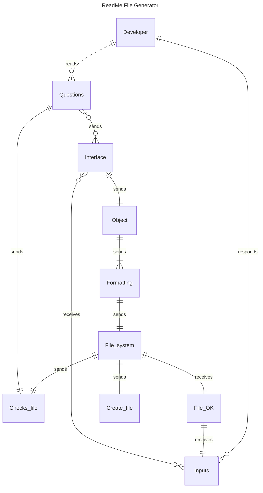

```mermaid    
---
title: ReadMe File Generator
---
erDiagram
    Developer ||..o{ Questions : reads
    Developer ||--o{ Inputs : responds
    Questions }o--o{ Interface : sends
    Interface ||--|| Object : sends
    Inputs }o--o{ Interface : receives
    Object ||--|{ Formatting : sends
    Formatting ||--|| File_system : sends
    File_system ||--|| Checks_file : sends
    File_system ||--|| File_OK : receives
    File_OK ||--|| Inputs : receives
    Checks_file||--|| Questions : sends
    File_system ||--|| Create_file : sends
```